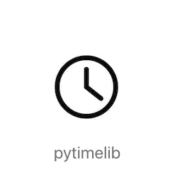

pytimelib
=========
* pytimelib is a simple model for python to do time conversion.
* python 3
* It is base on arrow library and pytz libraty, making it easy to use aware time and native time conversion.

Installation
=========
From PyPi:

    $ pip install pytimelib


Basic Usage
=========
* **cover datetime to timestamp:**

    ```python
    import time
    import datetime
    from pytimelib import TimeLib

    date_time = datetime.datetime.now()
    timestamp = TimeLib.datetime_to_timestamp(date_time)
    date_time = TimeLib.timestamp_to_datetime(timestamp)
    ```

* **datetime to timestamp conversion by timezone:**

   for example:

    ```python
    import time
    import datetime
    from pytimelib import TimeLib

    date_time = datetime.datetime.utcnow()
    print("datetime to timestamp by timezone(from UTC):")
    timestamp = TimeLib.datetime_to_timestamp_by_timezone(date_time,
                                                          from_tz="UTC")
    print(timestamp)
    print("timestamp to datetime by timezone(UTC to Los Angeles):")
    date_time = TimeLib.timestamp_to_datetime_by_timezone(
        timestamp, to_tz="America/Los_Angeles")
    print(date_time)
    ```

* **datetime and timeString conversion by timezone:**

   for example:

    ```python
    import time
    import datetime
    from pytimelib import TimeLib

    # datetime and timeString by timezone
    print("datetime to timeString by timezone(UTC to Los Angeles):")
    date_time = datetime.datetime.utcnow()
    time_str = TimeLib.datetime_to_datetime_str_by_timezone(date_time, to_tz="America/Los_Angeles")
    print(time_str)
    print("timeString to datetime by timezone(Los Angeles to UTC):")
    date_time = TimeLib.datetime_str_to_datetime_by_timezone(
        time_str, from_tz="America/Los_Angeles", to_tz="UTC")
    print(date_time)
    ```


Learning more
===============
Check the documentation for more examples or read test cases in unit test code.


Change Log
===============
[Change Log](https://github.com/Geoge-Henry/timelib-py/releases)


Discussing
===============
* submit issue
* email: henry_czh@foxmail.com
